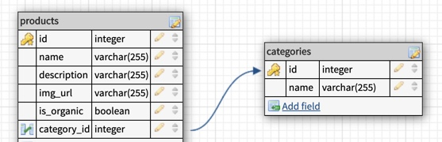

# Rails CRUD Application: Grocery app

Grocery app is an easy to use REST API that you can use as backend to implement a grocery app. All you'll have to do is just implement the front end with the thecnology of your choice such as React.
It already include a seed file with pictures for that specific product. 

### How to handle CRUD actions using http methods?
#### Category
- GET /categories - Retrieves a list of categories
- GET /categories/2 - Retrieves a specific category by its id.
- POST /categories - Creates a new category
- PUT /categories/1 - Updates category #1
- DELETE /categories/1 - Deletes category #1

#### Products
- GET /products - Retrieves a list of products
- GET /products/1 - Retrieves a product by its id.
- POST /products - Creates a new product
- PUT /products/1 - Updates product #1
- DELETE /products/1 - Deletes product #1

### Technologies
- **Rails**: as backend framework with MVC pattern approach.
- **Ruby**: as main programming language. Version: 2.6.3
- **PostgreSQL** as object-relational database.Versions 9.3 and up are supported.
- **Active Record**: as an ORM Framework provided by Rails, which easily allowed to implement all REST functionalities. 
- **JSON:API**: used to represent data. 

### Schema diagram


### Simple Code snippet
- app/models/category.rb
```ruby
class Category < ApplicationRecord
    has_many :products
end
```
- app/models/product.rb
```ruby
class Product < ApplicationRecord
    belongs_to :category
end
```

### View
/categories
```json
    [
    {
        "id": 1,
        "name": "Dairy",
        "created_at": "2020-09-16T01:20:34.951Z",
        "updated_at": "2020-09-16T01:20:34.951Z"
    },
    {
        "id": 2,
        "name": "Fruits",
        "created_at": "2020-09-16T01:20:34.960Z",
        "updated_at": "2020-09-16T01:20:34.960Z"
    }
]
```
/products
```json
[
    {
        "id": 1,
        "name": "Milk",
        "description": "Whole Milk, H.E.B., half gallon",
        "img_url": "https://i.imgur.com/tIFtvKk.jpg",
        "is_organic": false,
        "created_at": "2020-09-16T01:20:35.032Z",
        "updated_at": "2020-09-16T01:20:35.032Z",
        "category_id": 1
    },
    {
        "id": 2,
        "name": "Milk",
        "description": "Whole Milk, H.E.B., one gallon",
        "img_url": "https://i.imgur.com/jO4jNEb.jpg",
        "is_organic": false,
        "created_at": "2020-09-16T01:20:35.040Z",
        "updated_at": "2020-09-16T01:20:35.040Z",
        "category_id": 1
    }
]
```

### Link to deployed api
- https://shielded-retreat-96681.herokuapp.com/

### Features to be added in a later version
- Include error handling.
- Include more retrieve options.
- Improve root route with how to use instructions.
- Update routes to include /api/ at front. Example: GET /api/products
- Include nested objects. Example: on the categories route, include all products of each category.
- Improve how to present json information, more descriptive: Example: message: "OK", categories:
- Implement docker technology to enable application portability.

### Instructions for downloading the code and running it on localhost
- Fork and clone the repo.
- In your terminal, run the following commands:
```
$ bundle install
$ rails db:seed
$ rails server
```
- If any issue is presented, please create an issue request on this repo.

### Links and Resources
- Shopping List App using Node and Express.
https://github.com/shastier/Project-2-ShoppingListApp
